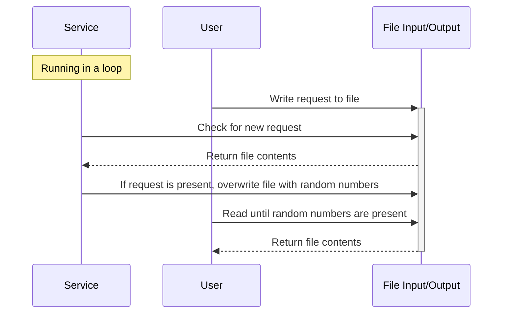

# Random Number Generator | Rust Microservice

This is a simple microservice that generates random numbers. It frequently checks a specified file (io.txt by default) for a new request consisting of a nonnegative integer. When it finds a valid request, it generates that many random numbers in the range [0, 2) and writes them to the file (one per line). It then awaits the next request.

## Usage

1. **Start the Service:** Run the microservice from the rand_num_service directory with `cargo run [path_to_file]` where `path_to_file` is the path to the file to be used for input and output. If no path is provided, the default path is `io.txt`.
1. **Make a Request:** Write a positive integer to the file. The service will then write generate the random number(s) and write them to the file.

   Sample Input

   ```
   3
   ```

1. **Receive the Response:** Read the file, checking for the presence of a floating point number on the first line to indicate that the request has been processed.

   Sample Output

   ```
   1.4844187
   0.912349
   0.49428713
   ```

1. **Stop the Service:** Press `Ctrl+C` to end the service.

## UML Sequence Diagram


